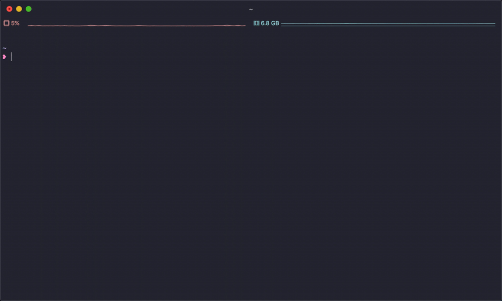

# gwi

> Interactive CLI for creating new JS repositories

[](https://travis-ci.org/iamnapo/gwi) [](https://www.npmjs.com/package/gwi) [](https://github.com/iamnapo/gwi/blob/master/LICENSE) [](https://greenkeeper.io/)

## Install

``` javascript
npm i -g gwi
```

## Usage



## License

MIT © [Napoleon-Christos Oikonomou](https://iamnapo.me)

## Acknowledgements

Based on [bitjson/typescript-starter](https://github.com/bitjson/typescript-starter).
